# 📁 Sistema de Ingestão Google Drive - Farmarcas

## 📋 Visão Geral

O **Google Drive Collector** é um sistema automatizado de ingestão de dados que realiza a coleta programática de arquivos do Google Drive para o data lake S3 da Farmarcas. Esta solução permite processar automaticamente planilhas Excel, arquivos CSV e outros documentos críticos do negócio, transformando-os em dados estruturados para análise.

> **Pipeline**: Google Drive API → Python Collector → S3 Bronze Layer  
> **Arquitetura**: Containerizada (Docker) executada via Kubernetes/Airflow  
> **Formatos Suportados**: Excel (.xlsx, .xls), CSV, com schema customizável  
> **Frequência**: Diário via orquestração Airflow

## 🎯 Importância Estratégica

### **Dados Críticos Coletados:**
- 📊 **Base de Produtos**: Catálogo farmacêutico com EAN, NCM, laboratórios
- 🏪 **Rede de Lojas**: CNPJ, razão social, localização e status
- 🚚 **Distribuidores**: Configurações de distribuição e regras comerciais
- 💰 **Verbas e Rebates**: Informações de incentivos e pagamentos
- 📍 **Geografia**: Divisões territoriais e hierarquias regionais
- 📈 **Alíquotas ICMS**: Dados fiscais por estado e produto

### **Casos de Uso de Negócio:**
- **Analytics de Vendas**: Análise de performance por região/produto
- **Compliance Fiscal**: Cálculos de impostos e obrigações
- **Gestão Comercial**: Monitoramento de redes e distribuidores
- **Business Intelligence**: Dashboards executivos e operacionais
- **Reconciliação Financeira**: Validação de verbas e pagamentos

## 🏗️ Arquitetura Técnica

```mermaid
graph TB
    subgraph "📁 Google Drive Sources"
        GD1[📋 Base de Produtos<br/>base.xlsx]
        GD2[🏪 Cadastro Lojas<br/>loja.xlsx]
        GD3[🚚 Distribuidores<br/>distribuidor.xlsx]
        GD4[💰 Verbas Dashboard<br/>verbas.xlsx]
        GD5[📂 Pasta Rebates<br/>Múltiplos arquivos]
        GD6[📍 Geografia<br/>geografia.xlsx]
        GD7[📊 Alíquotas ICMS<br/>aliquota_icms.xlsx]
    end
    
    subgraph "🔧 Collector System"
        AUTH[🔐 OAuth2 Authentication<br/>Service Account]
        CONFIG[⚙️ files_configs.yaml<br/>Mapeamento de Arquivos]
        MAIN[🐍 main.py<br/>Engine Principal]
        UTILS[🛠️ Utils Package<br/>auth, gdrive, logger, settings]
    end
    
    subgraph "🔄 Processing Pipeline"
        DOWNLOAD[⬇️ Download<br/>Google Drive API]
        PARSE[📝 Parse & Transform<br/>pandas + schema validation]
        TIMESTAMP[⏰ Add Ingestion<br/>cog_dt_ingestion]
        CONVERT[🔄 Convert to Parquet<br/>awswrangler]
    end
    
    subgraph "☁️ AWS Storage"
        S3[🗄️ S3 Bronze Layer<br/>farmarcas-production-bronze]
        PARTITION[📁 Partitioned by Date<br/>cog_dt_ingestion=YYYY-MM-DD]
        GLUE[📊 AWS Glue Catalog<br/>Metadata Registry]
    end
    
    subgraph "🚀 Orchestration"
        AIRFLOW[⚙️ Apache Airflow<br/>Daily Scheduler]
        K8S[☸️ Kubernetes<br/>Pod Execution]
        DOCKER[🐳 Docker Container<br/>Isolated Runtime]
    end
    
    %% Data Flow
    GD1 --> AUTH
    GD2 --> AUTH
    GD3 --> AUTH
    GD4 --> AUTH
    GD5 --> AUTH
    GD6 --> AUTH
    GD7 --> AUTH
    
    AUTH --> CONFIG
    CONFIG --> MAIN
    MAIN --> UTILS
    
    UTILS --> DOWNLOAD
    DOWNLOAD --> PARSE
    PARSE --> TIMESTAMP
    TIMESTAMP --> CONVERT
    
    CONVERT --> S3
    S3 --> PARTITION
    PARTITION --> GLUE
    
    AIRFLOW --> K8S
    K8S --> DOCKER
    DOCKER --> MAIN
    
    style AUTH fill:#e1f5fe
    style MAIN fill:#f3e5f5
    style S3 fill:#e8f5e8
    style AIRFLOW fill:#fff3e0
```



## 📚 Documentação Modular

Esta documentação está organizada em módulos especializados para facilitar a consulta e manutenção:

### 🔄 **[Fluxo de Ingestão](./fluxo_ingestao.md)**
- Processo completo passo a passo
- Fluxo de dados detalhado  
- Tratamento de múltiplas abas
- Processamento de pastas (Rebates)
- Pipeline de transformação

### ⚙️ **[Pré-requisitos](./pre_requisitos.md)**
- Autenticação Google Drive API
- Configuração Service Account
- Permissões AWS necessárias
- Variáveis de ambiente
- Dependências Python

### 📄 **[files_configs.yaml](./files_config_yaml.md)**
- Estrutura completa do arquivo
- Exemplos de configuração
- Schemas de dados
- Configuração de pastas
- Validações e tipos

### 🚀 **[DAG e Execução](./dag_e_execucao.md)**
- Integração com Airflow
- Configuração Kubernetes
- Scripts de execução
- Monitoramento e logs
- Deploy automatizado

### ⚠️ **[Erros Comuns](./erros_comuns.md)**
- Problemas de autenticação
- Falhas de download
- Erros de schema
- Issues de upload S3
- Troubleshooting completo

### 💡 **[Boas Práticas](./boas_praticas.md)**
- Configuração segura
- Otimização de performance
- Monitoramento efetivo
- Manutenção preventiva
- Desenvolvimento e testes

### 📊 **[Diagramas de Fluxo](./diagrama_fluxo.md)**
- Arquitetura visual
- Sequência de execução
- Fluxos de dados
- Interações entre componentes
- Cenários de falha

---

## 🚀 Quick Start

### 1. **Configuração Inicial**
```bash
# Clonar repositório
git clone <repo-url>
cd collector-google-drive

# Configurar credenciais
export GCO_TOKEN='{"access_token":"...", "refresh_token":"..."}'
```

### 2. **Execução Local**
```bash
# Build container
make build

# Executar localmente  
make run
```

### 3. **Deploy Produção**
```bash
# Via Airflow DAG
# O sistema executa automaticamente todos os dias às 07:30
```

## 📊 Dados Processados

### **Volumes Típicos (Produção)**
- **Arquivos processados**: ~10-15 por execução
- **Volume de dados**: 2-5 MB total por dia
- **Registros**: ~50K-100K linhas consolidadas
- **Tempo execução**: 5-10 minutos

### **Estrutura S3 Resultante**
```
s3://farmarcas-production-bronze/origin=eks/
└── database=bronze_gdrive/
    ├── base/cog_dt_ingestion=2025-08-07/base.parquet
    ├── loja/cog_dt_ingestion=2025-08-07/loja.parquet
    ├── distribuidor/cog_dt_ingestion=2025-08-07/distribuidor.parquet
    ├── verbas_base_industria/cog_dt_ingestion=2025-08-07/verbas.parquet
    ├── rebates_template/cog_dt_ingestion=2025-08-07/rebates_template.parquet
    └── geografia/cog_dt_ingestion=2025-08-07/geografia.parquet
```

---

## 🔧 Suporte e Manutenção

- **Equipe**: Data Engineering Farmarcas
- **SLA**: Execução diária com retry automático
- **Monitoramento**: CloudWatch + Airflow UI
- **Alertas**: Slack notifications em caso de falha

**Última atualização**: 07/08/2025
