# 📊 Sistema de Ingestão Radar - Farmarcas

## 📋 Visão Geral

O **Radar Collector** é um sistema automatizado de ingestão de dados que sincroniza informações críticas do sistema Radar (MySQL) para o data lake S3 da Farmarcas. Esta solução é responsável por capturar dados essenciais de farmácias, usuários, produtos, campanhas e métricas de performance através de uma pipeline robusta usando Airbyte e Airflow.

> **Pipeline**: MySQL Radar → Airbyte → S3 Bronze Layer  
> **Arquitetura**: Orquestrada via Airbyte e Airflow com scheduling diário  
> **Volume**: 80+ tabelas MySQL com dados críticos de negócio  
> **Frequência**: Diária às 2h UTC via DAG Airflow

## 🎯 Importância Estratégica

### **Dados Críticos Coletados:**
- 🏪 **Farmácias**: Dados de lojas, status operacional e métricas de performance
- 👥 **Usuários**: Informações de acesso, permissões e registros de atividade
- 📦 **Produtos**: Catálogo farmacêutico completo com EANs e informações PBM
- 🎯 **Campanhas**: Concursos, objetivos, scores e sistema de vouchers
- 📊 **Analytics**: Brand metrics, KPIs e dados para Business Intelligence
- 🔐 **Compliance**: Documentos, termos legais e trilhas de auditoria

### **Casos de Uso de Negócio:**
- **Dashboards Executivos**: Métricas de performance das farmácias e KPIs operacionais
- **BI Reports**: Relatórios de campanhas, produtos e análise de usuários
- **Data Science**: Análise de padrões de comportamento e performance das lojas
- **Compliance**: Rastreabilidade de documentos e termos aceitos para auditoria
- **Gamificação**: Acompanhamento de concursos, scores e distribuição de vouchers

## 🏗️ Arquitetura Técnica

```mermaid
graph TB
    subgraph "Sistema Radar Production"
        RadarDB[(MySQL Radar\ndb-mysql-radar-production)]
        RadarTables[80+ Tabelas:\n• store farmácias\n• store_metrics métricas\n• product catálogo\n• contest campanhas\n• user_access usuários]
    end
    
    subgraph "Airbyte Platform"
        AirbyteServer[Airbyte Server v0.3.23]
        SourceRadar[Source MySQL Radar\nbi-cognitivo-read user]
        DestS3[Destination S3\nParquet + SNAPPY]
        Connection[Connection\nconnection_mysql_s3_radar]
    end
    
    subgraph "AWS S3 Data Lake"
        S3Bronze[s3://farmarcas-production-bronze/\norigin=airbyte/database=bronze_radar/]
        DataPartition[Partitioned Data\ncog_dt_ingestion=YYYY-MM-DD]
        Compression[SNAPPY Compression]
    end
    
    subgraph "Airflow Orchestration"
        RadarDAG[DAG: dag_sync_airbyte_connections\nSchedule: 0 2 * * *]
        TriggerTask[AirbyteTriggerSyncOperator]
        SensorTask[AirbyteJobSensor]
        NotifyTask[Slack Notifications]
    end
    
    RadarDB --> RadarTables
    RadarTables --> SourceRadar
    SourceRadar --> Connection
    Connection --> DestS3
    DestS3 --> S3Bronze
    
    RadarDAG --> TriggerTask
    TriggerTask --> AirbyteServer
    AirbyteServer --> Connection
    TriggerTask --> SensorTask
    SensorTask --> NotifyTask
    
    S3Bronze --> DataPartition
    DataPartition --> Compression
    
    style RadarDB fill:#e1f5fe
    style S3Bronze fill:#f3e5f5
    style RadarDAG fill:#fff3e0
    style Connection fill:#e8f5e8
```



## 📚 Documentação Modular

Esta documentação está organizada em módulos especializados para facilitar a consulta e manutenção:

### 🔄 **[Fluxo de Ingestão](./fluxo_ingestao.md)**
- Pipeline completo do Radar com detalhes técnicos das 80+ tabelas sincronizadas. Processo passo a passo desde MySQL até S3 com configurações de sync modes.

### 🛠️ **[Ferramentas e Serviços](./ferramentas_servicos.md)**
- Stack tecnológico detalhado incluindo Airbyte, Airflow, MySQL e AWS. Versões, compatibilidades e dependências do sistema.

### ⚙️ **[Pré-requisitos](./pre_requisitos.md)**
- Configurações iniciais, credenciais MySQL, permissões AWS e variáveis de ambiente. Setup completo para execução do sistema.

### 📄 **[Configurações de Exemplo](./configuracoes_exemplo.md)**
- Exemplos práticos de configuração YAML para sources, destinations e connections. Templates e scripts de validação.

### ⚠️ **[Erros Comuns](./erros_comuns.md)**
- Diagnóstico e soluções para problemas frequentes de conectividade, autenticação e sincronização. Troubleshooting completo com comandos.

### 💡 **[Boas Práticas](./boas_praticas.md)**
- Recomendações para operação eficiente, manutenção preventiva e otimização de performance. Monitoramento e alertas.

### 📊 **[Diagramas de Fluxo](./diagrama_fluxo.md)**
- Representações visuais detalhadas da arquitetura, fluxos de dados e sequências de execução. Diagramas Mermaid completos.

---

## 🚀 Quick Start

### 1. **Configuração Inicial**
```bash
# Verificar pré-requisitos
# Ver: pre_requisitos.md

# Configurar credenciais Radar
export RADAR_PASS="<senha_mysql>"
```

### 2. **Execução Manual**
```bash
# Trigger sync via Airflow
# O sistema executa automaticamente diariamente às 2h UTC
```

### 3. **Monitoramento**
```bash
# Health check e status
# Ver: boas_praticas.md para comandos de monitoramento
```

## 📊 Dados Processados

### **Volumes Típicos (Produção)**
- **Tabelas sincronizadas**: 80+ tabelas MySQL com dados críticos
- **Volume de dados**: ~500MB-2GB por execução diária
- **Registros**: ~1M+ registros processados por sync
- **Tempo execução**: 45-60 minutos dependendo do volume

### **Estrutura S3 Resultante**
```
s3://farmarcas-production-bronze/origin=airbyte/database=bronze_radar/
├── store/
│   └── cog_dt_ingestion=2025-08-08/
│       ├── file_store_part_0.parquet
│       └── file_store_part_1.parquet
├── store_metrics/
│   └── cog_dt_ingestion=2025-08-08/
│       └── file_store_metrics_part_0.parquet
├── product/
│   └── cog_dt_ingestion=2025-08-08/
│       └── file_product_part_0.parquet
├── contest/
│   └── cog_dt_ingestion=2025-08-08/
│       └── file_contest_part_0.parquet
└── user_access/
    └── cog_dt_ingestion=2025-08-08/
        └── file_user_access_part_0.parquet
```

---

## 🔧 Suporte e Manutenção

- **Equipe**: Data Engineering Farmarcas
- **SLA**: 99.5% de disponibilidade com monitoramento 24/7
- **Monitoramento**: CloudWatch + Grafana + Airbyte UI
- **Alertas**: Slack (#data-engineering-alerts) + PagerDuty para críticos

**Última atualização**: 08/08/2025
